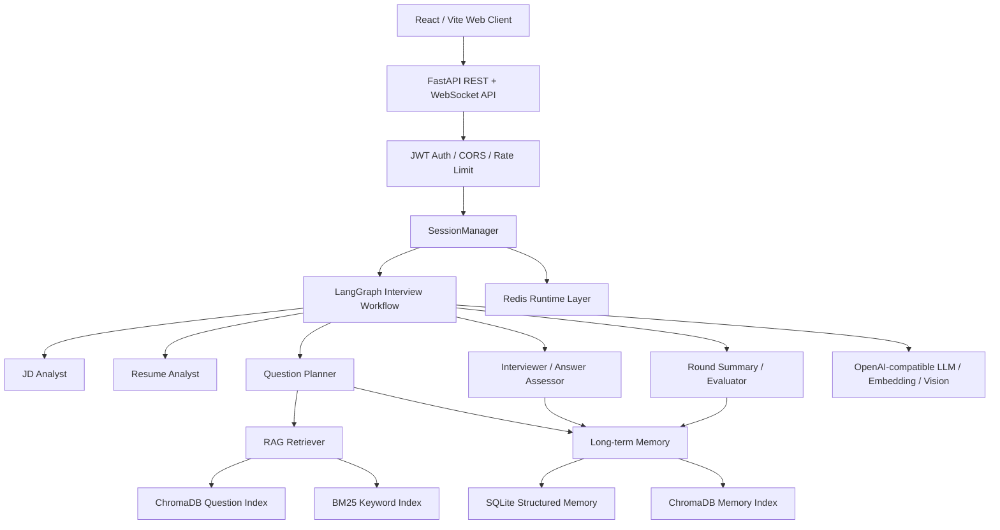

# AI Mock Interview Agent

面向 AI 应用开发岗的智能模拟面试系统。项目以岗位 JD 和候选人简历为输入，通过 LangGraph 编排多 Agent 工作流，结合 RAG 题库检索、长期记忆、实时 WebSocket 对话和结构化评估报告，模拟一场可追问、可复盘、可部署的技术面试。

## 核心亮点

- **JD + 简历驱动出题**：解析岗位要求和候选人经历，围绕项目经验、岗位技能缺口和历史弱项生成个性化问题。
- **双模式面试流程**：支持 `practice` 练习模式和 `professional` 专业模式；专业模式包含一面技术深度和二面技术广度。
- **LangGraph 多 Agent 编排**：使用 `StateGraph`、条件边、`interrupt_before` 和 checkpoint 管理可中断、可恢复的人机协同面试流程。
- **高级 RAG 检索链路**：基于 ChromaDB、Embedding、BM25、RRF、多查询、元数据重排、parent-child chunking 和 parent hydration 构建题库检索。
- **长期记忆系统**：使用 SQLite 保存结构化记忆，使用 ChromaDB 建立语义记忆索引，跨会话记录用户画像、简历项目、弱项技能和面试反思。
- **实时工程化交互**：FastAPI 同时提供 REST 与 WebSocket API，React/Vite 前端支持 JD 输入、简历上传、实时答题、追问、提前结束和报告展示。
- **Redis 运行增强**：Docker Compose 环境中启用 Redis，用于接口限流、回答并发锁、会话/报告缓存和 WebSocket 在线状态。
- **可量化评估**：提供 retrieval golden evaluation 与 RAGAS 生成评估，用指标衡量 RAG 召回、上下文质量和生成 groundedness。

## 技术栈

| 层级 | 技术 |
|---|---|
| 前端 | React 19 + Vite 6 + TypeScript + lucide-react |
| 后端 API | FastAPI + REST + WebSocket + CORS middleware |
| Agent 编排 | LangGraph StateGraph + 条件边 + interrupt + MemorySaver checkpoint |
| LLM 接入 | OpenAI-compatible SDK，支持 Chat、Structured Output、Streaming、Vision |
| 数据建模 | Pydantic v2 + Pydantic Settings |
| RAG 检索 | ChromaDB + OpenAI-compatible Embedding + BM25 + RRF |
| RAG 优化 | parent-child chunking、multi-query、metadata rerank、parent hydration、diversify |
| 长期记忆 | SQLite + ChromaDB semantic memory |
| 运行增强 | Redis rate limit、session cache、report cache、WebSocket presence、answer lock |
| 简历解析 | pdfplumber + Vision OCR fallback + link extraction + resume-JD matching |
| 评估测试 | pytest、pytest-asyncio、retrieval golden set、RAGAS、datasets |
| 部署 | Docker Compose + Nginx + Redis + FastAPI |

## 架构概览



## 面试流程

### Practice 模式

适合快速练习。只需要输入 JD，系统会分析岗位技能、检索题库、生成问题、动态追问，并在最后输出带参考答案和学习建议的练习报告。

```text
START
  -> analyze_jd
  -> plan_questions
  -> ask_question
  -> interrupt 等待用户回答
  -> assess_answer
  -> 条件路由：追问 / 下一题 / 生成 PracticeReport
  -> END
```

### Professional 模式

适合模拟真实技术面试。输入 JD 并上传简历后，系统会并行分析 JD 和简历，一面围绕项目与技术深度追问，二面根据一面总结扩展到技术广度、系统设计和 AI 应用工程能力。

```text
START
  -> parallel_analyze（resume + JD 并行）
  -> plan_questions_round1
  -> ask_question / assess_answer 循环
  -> summarize_round1
  -> plan_questions_round2
  -> ask_question / assess_answer 循环
  -> evaluate_interview
  -> END
```

## 功能能力

- 创建练习或专业面试会话。
- 上传 PDF / PNG / JPG / JPEG 简历并自动解析。
- 通过 WebSocket 实时接收问题、追问、状态和最终报告。
- 支持 REST API 调试和非实时客户端调用。
- 支持提前结束面试并基于已有回答生成阶段性报告。
- 支持注册/登录、JWT 鉴权、面试会话账号隔离。
- 支持 Redis 限流，降低公开 demo 被刷接口和 LLM quota 的风险。
- 支持报告页面展示、技能评分、轮次评分、招聘建议和 Markdown 导出。

## Quick Start

### 方式 A：Docker Compose 一键启动

推荐用于接近生产的本地演示。Compose 会启动 Redis、FastAPI API 和 React/Nginx Web 三个服务。

```bash
git clone https://github.com/han-dreamer/ai-mock-interview.git
cd ai-mock-interview
cp .env.example .env
```

编辑 `.env`，至少填入：

```env
LLM_API_KEY=your-llm-api-key
EMBEDDING_API_KEY=your-embedding-api-key
```

构建并初始化题库向量库：

```bash
docker compose build
docker compose run --rm api python -m scripts.init_vector_store --reset
docker compose up -d
```

打开：

```text
http://127.0.0.1
http://127.0.0.1/health
http://127.0.0.1:8000/docs
```

### 方式 B：本地开发启动

安装后端依赖：

```bash
python -m venv .venv
.venv\Scripts\activate
pip install -r requirements.txt
cp .env.example .env
python -m scripts.init_vector_store --reset
uvicorn app.main:app --host 0.0.0.0 --port 8000
```

启动前端：

```bash
cd web
npm install
npm run dev
```

打开：

```text
http://127.0.0.1:5173
```

### 方式 C：CLI / Gradio 辅助调试

CLI：

```bash
python -m scripts.run_interview_cli
```

Gradio 历史演示界面仍保留在 `frontend/`，主要用于内部调试：

```bash
python -m frontend.gradio_app
```

## 环境变量

项目使用 `.env` 管理配置，完整模板见 [.env.example](.env.example)。

核心变量：

```env
LLM_API_KEY=your-llm-api-key
LLM_BASE_URL=https://dashscope.aliyuncs.com/compatible-mode/v1
LLM_MODEL=qwen3.5-flash

VISION_MODEL=qwen-vl-plus

EMBEDDING_API_KEY=your-embedding-api-key
EMBEDDING_BASE_URL=https://dashscope.aliyuncs.com/compatible-mode/v1
EMBEDDING_MODEL=text-embedding-v3

AUTH_SECRET_KEY=change-me-to-a-long-random-secret
AUTH_TOKEN_EXPIRE_MINUTES=10080
REDIS_ENABLED=false
REDIS_URL=redis://localhost:6379/0

VITE_API_BASE_URL=/api
```

普通本地 Python 运行时 Redis 默认关闭。Docker Compose 会为 API 容器自动设置 `REDIS_ENABLED=true` 和 `REDIS_URL=redis://redis:6379/0`。

## 项目结构

```text
ai-mock-interview/
├── app/
│   ├── agents/              # LangGraph 多 Agent 节点与状态图
│   ├── api/                 # FastAPI REST / WebSocket 路由
│   ├── cache/               # Redis 限流、锁、缓存、在线状态
│   ├── llm/                 # OpenAI-compatible LLM 客户端与 Prompt
│   ├── memory/              # SQLite + ChromaDB 长期记忆
│   ├── models/              # Pydantic 数据模型
│   ├── rag/                 # RAG chunking、retrieval、rerank、RAGAS helper
│   ├── resume/              # 简历解析、链接抽取、JD 匹配
│   ├── services/            # SessionManager 与报告生成
│   └── utils/               # 文件解析兼容封装
├── web/                     # React/Vite/TypeScript 前端与 Nginx 配置
├── frontend/                # Gradio 辅助演示界面
├── data/
│   ├── question_bank/       # 结构化面试题库
│   ├── knowledge/           # RAG 知识条目
│   ├── sample_jds/          # 示例 JD
│   └── eval/                # retrieval / RAGAS golden 数据集
├── docs/                    # 架构、部署、Redis、RAG、评估文档
├── scripts/                 # 初始化、评估、调试脚本
├── tests/                   # API、Memory、Redis、Resume 测试
├── Dockerfile               # FastAPI API 镜像
├── docker-compose.yml       # Redis + API + Web 编排
└── requirements.txt
```

## API 概览

REST：

```text
POST /api/interview/start
POST /api/interview/start-with-resume
POST /api/interview/session/{session_id}/resume
POST /api/interview/session/{session_id}/start
POST /api/interview/session/{session_id}/answer
POST /api/interview/session/{session_id}/stop
GET  /api/interview/session/{session_id}/state
GET  /api/interview/report/{session_id}
```

WebSocket：

```text
ws://localhost:8000/api/ws/interview/{session_id}
```

客户端消息：

```json
{"type": "answer", "content": "我的回答..."}
{"type": "stop"}
{"type": "ping"}
```

服务端消息包括 `status`、`question`、`follow_up`、`interview_end`、`report` 和 `error`。

## RAG 与评估

初始化题库向量库：

```bash
python -m scripts.init_vector_store --reset
```

检索评估：

```bash
python -m scripts.evaluate_retrieval
```

RAGAS 评估：

```bash
python -m scripts.evaluate_ragas --variant full --answer-source generated --metrics all
```

当前 RAG 评估设计详见 [docs/rag_design.md](docs/rag_design.md) 和 [docs/rag_eval_report.md](docs/rag_eval_report.md)。

## 测试

```bash
pytest
```

前端构建检查：

```bash
cd web
npm run build
```

## 文档

- [项目展示总结](docs/project_showcase_summary.md)
- [架构文档](docs/architecture.md)
- [部署指南](DEPLOYMENT.md)
- [FastAPI / WebSocket API Contract](docs/fastapi_websocket_contract.md)
- [Redis 运行时增强设计](docs/redis_design.md)
- [RAG Design Notes](docs/rag_design.md)
- [RAG Evaluation Report](docs/rag_eval_report.md)
- [RAGAS Evaluation Upgrade](docs/ragas_evaluation_upgrade.md)
- [评分 Rubric](docs/scoring_rubric.md)

## License

MIT
