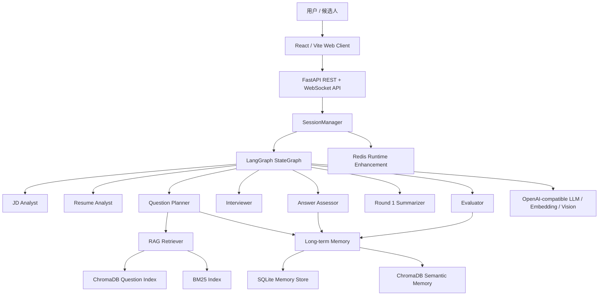
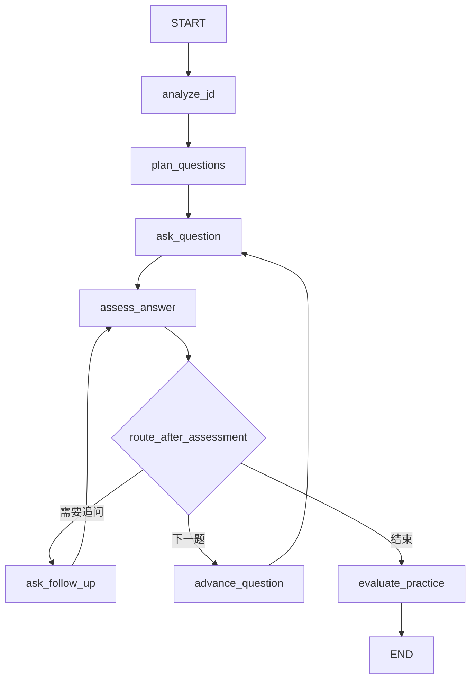
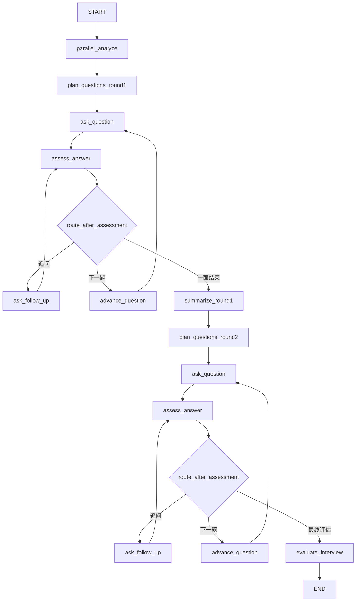

# 架构文档 — AI Mock Interview Agent

## 1. 系统总览

AI Mock Interview Agent 是一个 JD 与简历驱动的模拟面试系统。当前实现采用“React 前端 + FastAPI API + SessionManager + LangGraph 工作流 + RAG/Memory/Redis 支撑层”的架构。

系统的核心目标不是一次性生成题单，而是把真实面试拆成可中断、可恢复、可追问、可评估的状态机流程：



## 2. 分层架构

| 层级 | 主要模块 | 职责 |
|---|---|---|
| Web UI | `web/` | React/Vite 前端，负责 JD 输入、简历上传、WebSocket 实时对话、报告展示 |
| API 层 | `app/api/` | FastAPI REST 与 WebSocket 路由，处理 session、answer、resume、report 等接口 |
| 安全与运行增强 | `app/security.py`, `app/cache/` | JWT 鉴权、账号会话隔离、Redis 限流、回答锁、会话缓存、WebSocket presence |
| 会话管理 | `app/services/session_manager.py` | 创建 session、驱动 LangGraph、管理 checkpoint、同步报告和状态 |
| Agent 工作流 | `app/agents/` | JD 分析、简历分析、出题、提问、追问、评估、双轮流转 |
| RAG | `app/rag/` | 题库切分、向量检索、BM25、RRF、多查询、重排、parent hydration |
| Memory | `app/memory/` | 用户画像、简历项目、答题 episode、技能弱项、会话反思 |
| 数据模型 | `app/models/` | Pydantic 模型，约束 JD、简历、问题、回答评估、报告和 WS 协议 |
| 部署 | `Dockerfile`, `web/Dockerfile`, `docker-compose.yml` | API、Web/Nginx、Redis 三服务部署 |

## 3. 前端与 API 通信

当前主前端是 React/Vite，而不是早期的 Gradio。Gradio 仍保留在 `frontend/` 中，主要用于内部演示和快速调试。

React 前端能力：

- 创建练习模式或专业模式面试。
- 上传 PDF / PNG / JPG / JPEG 简历。
- 注册/登录后通过 JWT 访问后端；REST 使用 `Authorization` header，WebSocket 使用 query token。
- 通过 WebSocket 接收 `status`、`question`、`follow_up`、`report` 等消息。
- 展示实时对话、面试进度、技能标签、结构化报告。
- 支持提前结束面试并导出 Markdown 报告。

API 层同时支持 REST 和 WebSocket：

```text
POST /api/interview/start
POST /api/interview/start-with-resume
POST /api/interview/session/{session_id}/resume
POST /api/interview/session/{session_id}/start
POST /api/interview/session/{session_id}/answer
POST /api/interview/session/{session_id}/stop
GET  /api/interview/session/{session_id}/state
GET  /api/interview/report/{session_id}

WS   /api/ws/interview/{session_id}
```

REST 适合调试、测试和非实时客户端；WebSocket 负责真实面试体验。

## 4. LangGraph 工作流

项目中存在两套图：`practice` 和 `professional`。两者共享提问、追问、答案评估和状态管理逻辑，但前置分析与报告形式不同。

### 4.1 Practice 模式

Practice 模式只依赖 JD，适合快速练习。



最终输出 `PracticeReport`，包含总体评分、技能评分、遗漏知识点、参考答案和学习建议。

### 4.2 Professional 模式

Professional 模式输入 JD + 简历，采用双轮面试：

- Round 1：技术深度与项目深挖。
- Round 2：技术广度、系统设计、AI 应用工程能力。



`parallel_analyze` 使用 `asyncio.gather` 并行执行简历分析和 JD 分析，减少启动等待时间。

最终输出 `ProfessionalReport`，包含一面/二面分数、技术深度分、技术广度分、综合技能评分、优势、改进建议和招聘建议。

## 5. Human-in-the-loop 与 checkpoint

LangGraph 编译时使用：

```python
graph.compile(
    interrupt_before=["assess_answer"],
    checkpointer=MemorySaver(),
)
```

流程如下：

1. 图执行到 `ask_question` 或 `ask_follow_up`。
2. 面试官问题写入 `conversation_history`。
3. 图在 `assess_answer` 前暂停。
4. 前端通过 WebSocket 或 REST 提交候选人回答。
5. `SessionManager` 通过 `graph.update_state()` 注入 `current_candidate_answer`。
6. 图恢复执行，进入答案评估和条件路由。

每个 session 使用独立的 LangGraph `thread_id=session_id`，因此同一个 WebSocket 断开后可以重新连接并恢复最近状态。

## 6. 核心状态模型

`InterviewState` 是整个 LangGraph 的共享状态。关键字段包括：

```python
class InterviewState(TypedDict, total=False):
    interview_mode: Literal["practice", "professional"]
    user_id: str
    jd_text: str
    resume_text: str
    resume_parse_result: ResumeParseResult

    memory_context: str
    retrieved_memories: dict

    resume_profile: ResumeProfile
    resume_jd_match: ResumeJDMatch
    skill_matrix: SkillMatrix
    question_plan: list[QuestionItem]

    current_question_index: int
    follow_up_count: int
    max_follow_ups: int
    conversation_history: Annotated[list[ChatMessage], append_reducer]
    current_candidate_answer: str
    assessments: Annotated[list[AnswerAssessment], operator.add]

    current_round: int
    round1_question_plan: list[QuestionItem]
    round1_assessments: list[AnswerAssessment]
    round1_summary_text: str
    round2_question_plan: list[QuestionItem]

    practice_report: PracticeReport
    professional_report: ProfessionalReport
    final_report: InterviewReport
    interview_complete: bool
```

每个 Agent 节点只读写自己负责的字段，避免所有逻辑堆在一个大函数里。

## 7. Agent 节点职责

| 节点 | 输入 | 输出 | 说明 |
|---|---|---|---|
| `analyze_jd` | `jd_text` | `skill_matrix` | 提取岗位标题、经验等级、技能、权重、必需项 |
| `analyze_resume` | `resume_text` / `resume_parse_result` | `resume_profile` | 生成结构化简历画像、项目、链接、风险点 |
| `parallel_analyze` | JD + 简历 | `skill_matrix`, `resume_profile` | 并行准备专业模式上下文 |
| `plan_questions` | 技能矩阵 + RAG + Memory | `question_plan` | 练习模式题单 |
| `plan_questions_with_resume` | 技能矩阵 + 简历画像 + RAG + Memory | `question_plan`, `resume_jd_match` | 专业模式一面题单 |
| `plan_questions_round2` | 一面总结 + 技能矩阵 + RAG + Memory | `round2_question_plan` | 专业模式二面题单 |
| `ask_question` | 当前题目 | `conversation_history` | 生成面试官提问 |
| `ask_follow_up` | 当前评估结果 | `conversation_history` | 针对遗漏点追问 |
| `assess_answer` | 候选人回答 + 参考要点 | `assessments` | 评分并判断是否追问 |
| `summarize_round1` | 一面对话与评估 | `round1_summary_text` | 生成二面规划依据 |
| `evaluate_practice` | 全部练习对话 | `practice_report` | 输出练习报告和参考答案 |
| `evaluate_interview` | 双轮对话与评估 | `professional_report` | 输出专业面试报告 |

## 8. RAG 架构

RAG 的职责是为 Question Planner 提供可追溯的题库参考，而不是把整份题库塞进 prompt。

当前语料包括：

- `data/question_bank/`：结构化面试题库。
- `data/knowledge/`：AI 应用、RAG、趋势等知识条目。
- `data/eval/`：检索评估和 RAGAS golden 数据。

离线索引流程：

```text
structured question / knowledge item
  -> parent-child structure-aware chunking
  -> contextual chunk header
  -> embedding
  -> ChromaDB persistent collection
  -> BM25 index on first retrieval
```

在线检索流程：

```text
interview state
  -> build 3-5 deterministic queries
  -> vector search + BM25 search
  -> RRF fusion
  -> multi-query score fusion
  -> metadata-aware rerank
  -> hydrate child chunks to parent questions
  -> deduplicate and diversify
  -> pass references to Question Planner
```

关键优化：

- Practice 使用 JD 高权重技能构造 query。
- Round 1 使用 JD 技能、简历项目、简历-JD 匹配信号构造 query。
- Round 2 使用一面薄弱点、系统设计和 AI Agent/RAG 广度构造 query。
- Reranker 根据 required skill、简历匹配技能、缺失技能、轮次目的、难度和类别加权。
- Planner 输出 `source_ids`，系统会清洗非法来源，保留可追溯性。

详见 [RAG Design Notes](rag_design.md) 和 [RAG Evaluation Report](rag_eval_report.md)。

## 9. 长期记忆架构

Memory 模块用于跨会话个性化。它不是短期聊天历史，而是用户级长期记忆。

存储分两层：

- SQLite：保存结构化 `MemoryItem` 和 `SkillMemory`。
- ChromaDB：保存 MemoryItem 的语义向量索引。

记忆类型：

| 类型 | 说明 |
|---|---|
| `profile` | 用户画像与简历技能概览 |
| `resume_project` | 简历项目、技术栈、可深挖点 |
| `interview_episode` | 单题回答表现、覆盖点、遗漏点 |
| `session_reflection` | 一次面试后的整体反思 |
| `preference` / `strategy` | 后续可扩展的偏好和训练策略 |

启动面试时：

```text
user_id + JD + resume
  -> structured memory recall
  -> semantic memory recall
  -> memory_context
  -> Question Planner personalization
```

回答评估后：

```text
assessment
  -> save interview episode
  -> update skill memory
  -> index memory item into ChromaDB
```

面试结束后：

```text
final report
  -> save session reflection
  -> index reflection for future recall
```

## 10. Redis 运行时增强

Redis 是增强层，不是核心持久化数据源。普通本地 Python 运行默认关闭 Redis；Docker Compose 中默认启用 Redis。

Redis 当前承担：

| 能力 | 实现 |
|---|---|
| 固定窗口限流 | `INCR + EXPIRE` |
| 回答并发锁 | `SET key value NX PX ttl` |
| WebSocket 在线状态 | TTL presence key |
| 会话快照缓存 | session meta / snapshot |
| 报告缓存 | report JSON cache |

Redis 不可用时，系统采用 fail-open 策略：限流、缓存、presence 跳过，单进程仍由 `asyncio.Lock` 保护。

详见 [Redis 运行时增强设计](redis_design.md)。

## 11. 简历解析与匹配

简历处理链路：

```text
UploadFile
  -> save to uploads/resumes/{session_id}
  -> PDF: pdfplumber extract_text
  -> image: Vision OCR
  -> scanned PDF: Vision OCR fallback
  -> normalize text
  -> extract links/contact
  -> Resume Analyst structured profile
  -> resume-JD deterministic matching
  -> Planner project deep-dive signals
```

支持格式：

- PDF
- PNG
- JPG
- JPEG

简历画像包括技能、项目、经历、亮点、风险点、链接和解析 warning。专业模式一面会优先围绕项目和 JD 匹配技能深挖。

## 12. Structured Output

所有关键 Agent 输出都通过 Pydantic 模型约束：

- `SkillMatrix`
- `ResumeProfile`
- `QuestionPlan`
- `AnswerAssessment`
- `Round1Summary`
- `PracticeReport`
- `ProfessionalReport`

`LLMClient.chat_structured()` 会：

1. 根据 Pydantic model 构造字段说明。
2. 将输出格式要求注入 system prompt。
3. 优先使用 `response_format={"type": "json_object"}`。
4. 清洗 markdown fence 或多余文本。
5. 使用 `model_validate_json()` 校验。
6. 遇到 schema echo 或校验失败时自动重试。

## 13. 评估与测试

项目包含三类评估：

| 类型 | 脚本/目录 | 目的 |
|---|---|---|
| 单元/接口测试 | `tests/` | 验证 API contract、memory、Redis、resume pipeline |
| 检索评估 | `scripts.evaluate_retrieval` | 使用 golden set 评估 Hit@5、Recall@5、MRR@10 |
| RAGAS 评估 | `scripts.evaluate_ragas` | 评估 faithfulness、answer relevancy、context precision、context recall |

常用命令：

```bash
pytest
python -m scripts.evaluate_retrieval
python -m scripts.evaluate_ragas --variant full --answer-source generated --metrics all
```

## 14. 部署架构

Docker Compose 包含三个服务：

```text
web   -> React static build + Nginx reverse proxy
api   -> FastAPI + LangGraph + RAG + Memory
redis -> Redis 7 runtime enhancement layer
```

Nginx 负责：

- 服务 React 静态文件。
- 代理 `/api/` 到 `api:8000/api/`。
- 支持 WebSocket upgrade。
- 代理 `/health` 到后端 health check。

持久化目录：

```text
./data
./chroma_data
./memory_data
./redis_data
./uploads
./exports
```

详见 [Deployment Guide](../DEPLOYMENT.md)。
