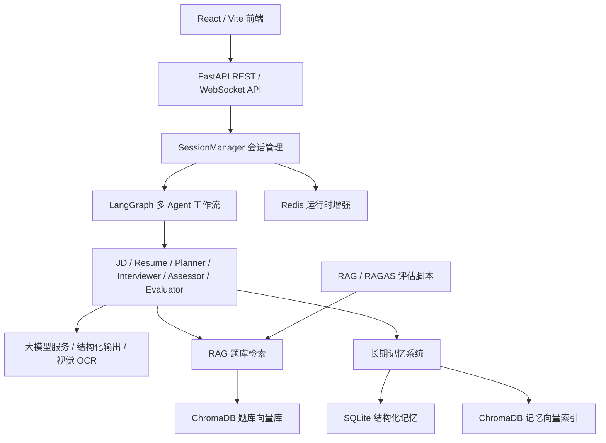
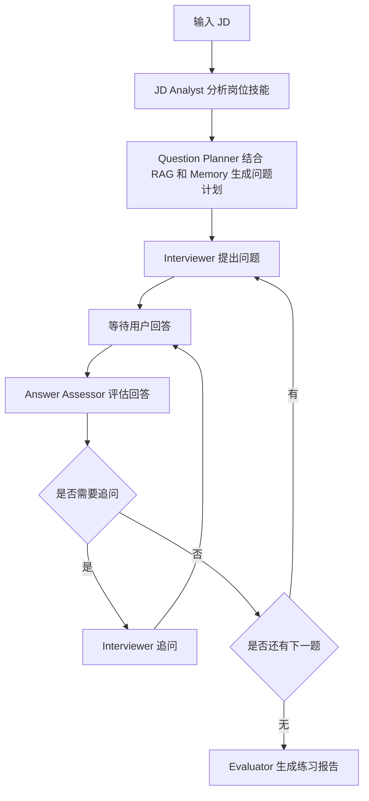
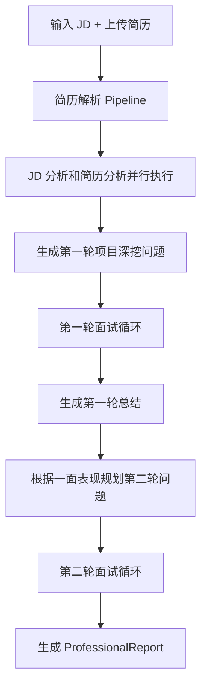
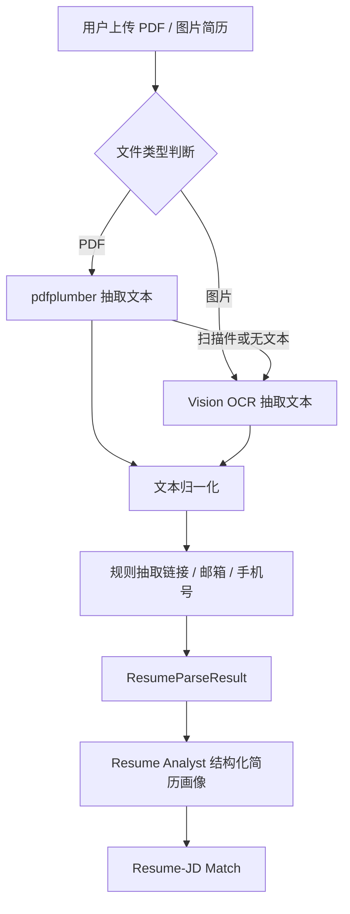
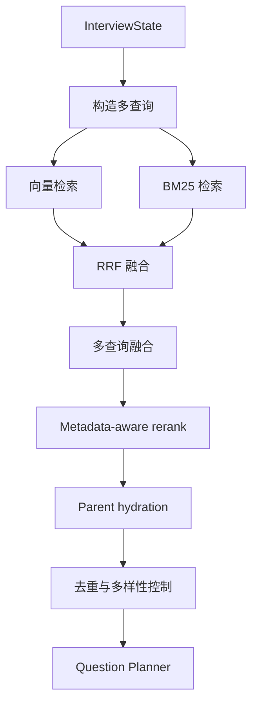

# AI 模拟面试 Agent 项目课程汇报说明

## 1. 项目背景

随着大模型应用、AI Agent 和 RAG 技术在实际业务中的使用越来越广，AI 应用开发岗位对求职者的要求也不再只是“会调用大模型 API”，而是需要理解多 Agent 工作流、结构化输出、RAG 检索增强、长期记忆、实时交互、服务化部署和效果评估等完整链路。

传统模拟面试工具通常存在几个问题：

- 题目比较泛化，难以根据具体 JD 生成针对性问题。
- 很少结合候选人的真实简历和项目经历进行深挖。
- 面试过程缺少连续追问，不能模拟真实面试官的互动。
- 练习结果通常只给出简单反馈，缺少结构化能力评估。
- 系统不能记录用户长期弱项，下一次练习又从零开始。
- 对 RAG 和生成结果缺少量化评估，难以判断系统优化是否有效。

因此，本项目设计并实现了一个面向 AI 应用开发岗、Agent 岗和 RAG 岗求职者的 **AI 模拟面试 Agent 系统**。系统支持用户输入岗位 JD 和个人简历，通过多 Agent 工作流自动完成岗位能力分析、简历解析、个性化出题、实时追问、答案评估、双轮面试和最终报告生成，形成从“练题”到“模拟真实面试”的闭环训练。

## 2. 项目目标

本项目希望解决的是：如何让模拟面试更接近真实技术面试，并且让整个过程具备可解释、可追踪、可评估和可持续改进的能力。

具体目标包括：

- 支持 JD 驱动的岗位能力分析，提取岗位所需技能矩阵。
- 支持简历驱动的个性化面试，围绕候选人项目和经历进行追问。
- 使用多 Agent 架构拆分不同职责，使系统逻辑更清晰。
- 使用 RAG 从题库和知识库中检索参考问题，提高出题质量。
- 支持实时对话、追问、停止面试、生成报告等完整交互流程。
- 引入长期记忆机制，记录用户历史表现和技能弱项。
- 构建 RAG 评估体系，用指标衡量检索和生成效果。
- 提供前端演示界面和后端 API，形成可运行的 AI 应用系统。

## 3. 系统整体架构

项目整体采用“前端演示层 + API 服务层 + 会话管理层 + LangGraph Agent 工作流 + RAG/Memory 支撑层 + 评估层”的架构。

从整体上看，用户通过前端或 API 创建面试会话，上传 JD 和简历。后端创建会话后，由 `SessionManager` 调用 LangGraph 工作流。LangGraph 内部不同 Agent 节点按照状态机执行：先分析 JD 和简历，再结合 RAG 和长期记忆规划问题，之后进入面试循环，根据用户回答决定追问、换题或结束，最后生成结构化报告。

## 4. 核心技术选型

本项目使用的技术栈可以分为几个部分。

后端服务使用 `FastAPI`，用于提供 REST API、WebSocket 实时通信和简历上传接口。WebSocket 主要用于实时面试对话，REST API 主要用于调试、前端调用和测试。

Agent 编排使用 `LangGraph`。相比普通链式调用，LangGraph 更适合表达本项目这种多步骤、可中断、可恢复、有条件分支的工作流。

大模型调用使用 OpenAI-compatible API 封装。项目中的 LLM Client 支持普通对话、流式输出、视觉模型调用和 Pydantic 结构化输出。

结构化数据建模使用 `Pydantic`。JD 分析、简历画像、问题计划、答案评估和最终报告都定义成明确的数据模型，减少大模型自由输出带来的不稳定性。

RAG 检索使用 `ChromaDB`、向量检索、`BM25` 和 RRF 融合。题库和知识库会被切分后写入 ChromaDB，在线出题时根据 JD、简历和历史表现进行检索。

长期记忆使用 `SQLite` 和 `ChromaDB`。SQLite 保存结构化记忆，ChromaDB 保存语义索引，用于跨面试会话召回用户历史弱项和项目记忆。

前端主界面使用 `React + Vite + TypeScript`，通过 REST API 创建会话、上传简历，并通过 WebSocket 完成实时面试对话。早期的 `Gradio` 界面仍保留为内部调试和快速演示工具。

运行时增强使用 `Redis`，用于公开试用环境中的接口限流、回答并发锁、WebSocket 在线状态和会话/报告缓存。Redis 是增强层而不是核心存储，关闭 Redis 时系统仍可在本地完成主要面试流程。

评估部分使用自定义检索评估脚本和 `RAGAS`，用于评估 RAG 的检索质量和生成答案的 groundedness。

## 5. 多 Agent 工作流设计

项目中不是使用一个大 prompt 完成所有任务，而是将面试流程拆成多个职责明确的 Agent 节点。

主要 Agent 包括：

- **JD Analyst**：分析岗位 JD，提取岗位名称、经验等级、技能列表、技能权重和是否必需。
- **Resume Analyst**：分析简历文本，提取候选人的教育背景、技能、项目经历、工作经历、亮点和风险点。
- **Question Planner**：根据 JD 技能矩阵、简历画像、RAG 检索结果和长期记忆生成面试问题计划。
- **Interviewer**：以自然面试官口吻提出问题或追问。
- **Answer Assessor**：对用户回答进行评分，判断覆盖点、遗漏点以及是否需要追问。
- **Evaluator**：根据完整对话和每题评估结果生成最终报告。
- **Parallel Prep**：在专业面试模式中并行执行 JD 分析和简历分析，减少等待时间。

### 5.1 练习模式流程

练习模式更适合快速刷题和查漏补缺。流程如下：

练习模式的最终报告会包含总体评分、技能维度评分、遗漏知识点、参考答案和学习建议。

### 5.2 专业面试模式流程

专业面试模式更接近真实技术面试，包含两轮：

- 第一轮：技术深度，重点围绕候选人简历项目进行追问。
- 第二轮：技术广度，重点考察系统设计、架构能力、AI Agent/RAG 等更宽的技术理解。

这种设计使系统能够模拟真实面试中的递进过程：先看候选人是否真的理解自己的项目，再看其技术广度和架构思维。

## 6. Human-in-the-loop 设计

面试系统和普通问答系统不同，它不能一次性生成完整结果，而是需要在每一轮问题之后等待用户输入，再根据用户回答动态决定下一步。

本项目通过 LangGraph 的 `interrupt_before` 机制实现 human-in-the-loop。

系统运行到提问节点后，会在答案评估节点之前暂停。用户通过 REST API 或 WebSocket 提交回答后，后端将回答写入 LangGraph 状态，然后恢复图执行，进入答案评估和路由判断。

这个设计带来的好处是：

- 面试流程由图状态统一管理，而不是散落在多个回调函数里。
- 用户回答可以作为状态注入，再继续执行后续 Agent 节点。
- 可以支持 WebSocket 断线恢复，因为图状态有 checkpoint。
- 支持 REST 和 WebSocket 共用同一套会话逻辑。

## 7. 简历解析与 JD 匹配

简历解析是专业面试模式的关键模块。本项目没有直接把简历文件交给大模型，而是设计了一条分层 pipeline。

简历解析结果包括：

- 原始文本和归一化文本。
- 文件名、文件类型、解析器类型、页数、字符数等 metadata。
- GitHub、Gitee、GitLab、LinkedIn、博客、邮箱、手机号等联系信息。
- 解析 warning，例如文本过短、扫描 PDF fallback、未检测到链接等。

之后 Resume Analyst 会基于解析结果生成结构化简历画像，包括候选人技能、项目、经历、亮点、风险点和总结。再由匹配模块将简历技能和 JD 技能进行对齐，找出匹配技能、缺失技能、相关项目和面试重点。

这样做的意义是：系统不只会问通用岗位题，还可以围绕候选人自己的项目进行深挖，比如“你这个项目为什么这样设计”“你实际负责了哪一部分”“这个项目和 JD 中的 RAG/LangGraph/FastAPI 能力有什么对应关系”。

## 8. RAG 题库检索设计

项目的题目生成并不是完全依赖大模型自由发挥，而是引入了 RAG。RAG 的作用是从题库和知识库中检索与当前岗位、简历和面试阶段相关的参考内容，再交给 Question Planner 生成最终问题。

### 8.1 为什么需要 RAG

即使题库规模不算特别大，直接把全部题库塞进 prompt 也不是好方式。因为这样会让 prompt 变长、成本变高、上下文变乱，而且以后题库扩展后更难维护。

使用 RAG 的好处是：

- 每次只取和当前 JD、简历、面试阶段相关的问题。
- 题库可以持续扩展，不需要改 prompt。
- 可以追踪每道生成问题参考了哪些来源。
- 可以对检索质量做离线评估。
- 可以根据检索结果优化系统，而不是凭感觉调整 prompt。

### 8.2 Parent-child chunking

项目中的题库不是简单按固定长度切分，而是采用结构化 parent-child chunking。

一个完整题目是 parent，系统会把它拆成多个 child chunk，例如：

- `question_stem`：题干本身。
- `question_summary`：题干加答案点摘要。
- `answer_point`：每个参考答案点。
- `follow_up`：每个追问方向。
- `generated_query`：自动生成的检索友好查询。

检索时使用 child chunk 提高召回率，但生成问题时会 hydrate 回 parent question，保证给大模型的是完整题目信息。

### 8.3 混合检索与重排

在线检索流程包括：

1. 根据当前状态构造多个检索 query，例如 JD 核心技能、简历项目、一面弱项、系统设计方向等。
2. 同时执行向量检索和 BM25 关键词检索。
3. 使用 RRF 将不同检索结果融合。
4. 对多 query 的结果再次融合。
5. 根据 JD 必需技能、简历匹配技能、缺失技能、问题难度和面试轮次进行 metadata-aware rerank。
6. 将 child chunk 回填成 parent question。
7. 去重并控制类别和难度多样性。
8. 将参考问题和 source id 交给 Question Planner。

通过这种方式，系统能够兼顾语义相似和技术关键词精确匹配。例如 `FastAPI`、`LangGraph`、`RAGAS`、`WebSocket` 这类关键词，仅靠向量检索有时不稳定，BM25 可以补足这部分能力。

## 9. 长期记忆设计

为了让系统支持多次练习后的个性化提升，本项目实现了长期记忆模块。

长期记忆主要保存几类信息：

- 用户画像和偏好。
- 简历中的项目记忆。
- 每次回答后的面试 episode。
- 每个技能的掌握情况。
- 每次面试结束后的 session reflection。

存储上使用两部分：

- `SQLite`：保存结构化记忆，例如技能名称、平均分、最近得分、弱项、证据 id 等。
- `ChromaDB`：保存记忆内容的语义索引，用于根据当前 JD 和简历召回相关历史记忆。

在新面试开始时，系统会根据 `user_id` 召回长期记忆，并格式化成 memory context 注入 Question Planner。这样系统可以优先追问用户过去表现较弱的技能，也可以避免重复问已经掌握较好的内容。

例如，如果用户之前在 “RAG 评估指标”“结构化输出失败处理”“WebSocket 断线恢复” 这些问题上表现不佳，那么下一次面试时，系统会倾向于在这些方向进行更有针对性的提问。

## 10. FastAPI 与 WebSocket 服务化设计

项目后端提供 REST 和 WebSocket 两套接口。

REST API 主要用于：

- 创建面试会话。
- 上传简历。
- 启动面试图。
- 提交答案。
- 提前停止面试。
- 查询会话状态。
- 获取最终报告。

WebSocket 主要用于实时面试对话。用户连接到某个 session 后，系统会自动启动或恢复面试流程，然后不断发送问题、追问、状态和最终报告。

会话状态由 `SessionManager` 统一管理。每个 session 具有独立的锁，避免重复启动或并发提交答案导致状态错乱。LangGraph 使用 `thread_id=session_id` 保存 checkpoint，因此 WebSocket 断线重连后可以继续从最新状态恢复。

这样的设计使项目不只是一个本地 demo，而更接近真实 AI 应用后端服务。

## 11. 前端演示与报告展示

项目当前使用 React/Vite 作为主要前端。用户可以在页面中选择练习模式或专业面试模式，输入 JD，上传简历，开始面试，实时输入回答，并查看最终报告。Gradio 界面仍保留在 `frontend/` 目录中，主要用于内部调试和快速演示。

前端的特点包括：

- 通过 REST API 和 WebSocket 调用 FastAPI 后端，实现前后端解耦。
- 支持展示对话历史、连接状态、当前面试阶段和进度。
- 支持练习报告和专业双轮面试报告。
- 支持访问码、简历上传、实时追问和提前结束面试。
- 支持将面试记录和报告导出为 Markdown。

虽然前端不是本项目的主要技术重点，但它提供了完整可演示的用户入口。

## 12. 评估体系

本项目不仅实现了 RAG，还对 RAG 效果进行了量化评估。

### 12.1 检索层评估

检索层使用 golden retrieval cases 进行评估，指标包括：

- `Hit@5`：Top 5 中是否命中至少一个期望来源。
- `Recall@5`：Top 5 中召回了多少比例的期望来源。
- `MRR@10`：第一个正确来源在 Top 10 中的位置。

项目对比了多种 RAG 变体，包括 vector-only、hybrid、multi-query hybrid 和 parent-hydrated multi-query hybrid。

根据当前评估结果，vector-only 的 `Recall@5` 为 `0.440`，加入 BM25 + RRF 后提升到 `0.507`，完整 multi-query pipeline 提升到 `0.554`，相对 vector-only 提升约 `25.9%`。

### 12.2 RAGAS 生成层评估

生成层使用 RAGAS 评估系统生成答案是否忠实于检索上下文，以及答案是否与问题相关。

指标包括：

- `Faithfulness`：回答是否基于检索上下文，没有编造。
- `Answer Relevancy`：回答是否与问题相关。
- `Context Precision`：检索上下文是否大多有用。
- `Context Recall`：检索上下文是否覆盖参考答案所需信息。

在优化 evidence-rich context formatter 和 grounded QA prompt 后，最终在 12 个 QA golden cases 上达到：

| 指标 | 分数 |
|---|---:|
| Faithfulness | 0.955 |
| Answer Relevancy | 0.960 |
| Context Precision | 1.000 |
| Context Recall | 0.958 |

这说明系统不仅能够检索到相关内容，也能够基于检索内容生成较可靠的回答。

## 13. 项目亮点

本项目的主要亮点可以概括为以下几点。

第一，使用 LangGraph 构建了多 Agent 状态机，而不是简单 prompt chain。系统支持条件路由、追问循环、双轮面试、checkpoint 和 human-in-the-loop。

第二，实现了 JD 和简历双驱动的个性化面试。系统不仅分析岗位要求，还解析候选人项目经历，使问题更贴近真实面试。

第三，RAG 设计比较完整。项目使用 parent-child chunking、混合检索、RRF、多查询、重排、父文档回填和 source tracing，而不是简单向量 top-k。

第四，引入长期记忆机制。系统可以记录用户多次面试中的弱项和项目风险，并在下一次面试中使用这些记忆进行个性化出题。

第五，具备工程化 API。FastAPI REST 和 WebSocket 共用同一套会话管理逻辑，支持简历上传、实时对话、状态查询和断线恢复。

第六，具备评估闭环。项目使用检索指标和 RAGAS 指标评估 RAG 效果，并根据指标优化上下文构造和回答生成策略。

## 14. 当前不足与后续优化方向

虽然项目已经实现了完整流程，但仍然有一些可以继续优化的方向。

首先，简历解析还可以进一步增强。目前支持 PDF 和图片，但对于复杂表格、双栏简历、扫描件 OCR 质量等情况仍可能不稳定。后续可以参考更成熟的文档解析方案，例如版面分析、多模态文档理解或 MinerU 类工具。

其次，长期记忆目前主要基于规则和结构化更新，后续可以增加更智能的 memory consolidation，例如定期合并重复记忆、遗忘低价值记忆、抽取用户偏好和学习计划。

第三，RAG 的题库规模还可以继续扩大。当前题库已经覆盖 Python、后端、系统设计、机器学习、AI 应用工程和 RAG 等方向，后续可以扩展更多真实企业面试题和不同岗位题库。

第四，前端已经从早期 Gradio 演示升级为 React/Vite 实时面试界面。后续如果进一步产品化，可以继续补充用户登录、历史报告管理、题目复盘和学习路径。

第五，可以引入更真实的语音面试能力，例如语音输入、语音播报、语速分析和表达流畅度评分，使系统更接近真实面试场景。

## 15. 总结

本项目围绕“如何用 AI Agent 模拟真实技术面试”这一目标，构建了一个完整的 AI 应用系统。它不仅调用大模型生成问题，还结合了 JD 分析、简历解析、RAG 检索、长期记忆、实时交互、结构化评估和 RAGAS 量化评估。

从技术角度看，项目体现了当前 AI 应用开发中的几个核心能力：多 Agent 编排、结构化输出、RAG 工程化、个性化 memory、FastAPI 服务化和效果评估闭环。

从应用角度看，系统可以帮助求职者进行更贴近真实岗位和真实简历的模拟面试训练，让面试练习从“泛化刷题”变成“围绕目标岗位和个人经历的个性化闭环提升”。
