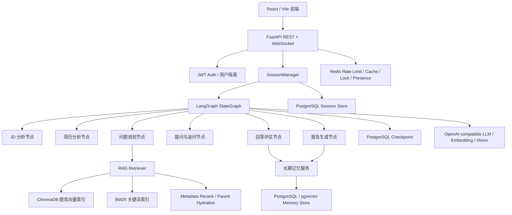

# AI Mock Interview Agent 项目展示总结

这份文档用于 GitHub 项目展示、课程汇报和简历项目描述。详细架构见
`docs/architecture.md`，RAGAS 评测实验细节见 `docs/ragas_evaluation_upgrade.md`。

## 项目一句话

AI Mock Interview Agent 是一个面向 AI 应用开发岗位的模拟面试系统。系统以岗位 JD
和候选人简历为输入，通过 LangGraph 编排多阶段 Agent 工作流，结合 RAG 题库检索、
用户长期记忆、FastAPI/WebSocket 实时交互和结构化评估报告，模拟可追问、可中断、
可复盘、可部署的技术面试流程。

## 适用场景

- AI 应用开发岗、后端开发岗、算法工程相关岗位的面试练习。
- 根据 JD 和简历自动生成个性化问题，而不是固定题库问答。
- 支持练习模式和专业模拟模式，适合个人练习、小范围同学试用和课程项目展示。
- 支持历史会话、报告管理、用户隔离和本地评测，便于从 demo 走向可用产品。

## 技术栈总览

| 模块 | 技术栈 | 作用 |
|---|---|---|
| 前端 | React 19, Vite, TypeScript | JD 输入、简历上传、实时答题、报告展示 |
| 后端 API | FastAPI, REST, WebSocket | 会话创建、实时面试、报告查询、认证接口 |
| Agent 编排 | LangGraph StateGraph, conditional edges, interrupt, checkpoint | 多阶段面试流程、追问、双轮面试、中断恢复 |
| 会话持久化 | PostgreSQL, langgraph-checkpoint-postgres | LangGraph checkpoint 和面试会话状态持久化 |
| 用户系统 | JWT, bcrypt, PostgreSQL | 注册登录、用户隔离、历史记录归属 |
| RAG 检索 | ChromaDB, Embedding, BM25, RRF, multi-query, rerank | 根据岗位技能和上下文检索面试题与知识点 |
| RAG 优化 | parent-child chunking, parent hydration, metadata rerank, diversify | 提升召回、降低上下文噪声、保留可追溯来源 |
| 长期记忆 | PostgreSQL, pgvector, ChromaDB fallback | 跨会话记录用户画像、弱项技能、答题表现 |
| 运行增强 | Redis | 限流、回答并发锁、session/report cache、WebSocket presence |
| 简历解析 | pdfplumber, Vision OCR fallback, link extraction | 解析 PDF/图片简历并提取项目、技能、链接 |
| 评测体系 | pytest, retrieval golden set, RAGAS, datasets, matplotlib | 检索评测、生成答案评测、CSV/Markdown/PNG 报告 |
| 部署 | Docker Compose, Nginx, Redis, FastAPI | 本地/服务器部署和前后端服务编排 |

## 架构概览



## Agent 工作流设计

项目不是简单的单轮 LLM 问答，而是把面试拆成多个 LangGraph 节点：

- `analyze_jd`：抽取岗位技能、经验要求和考察重点。
- `analyze_resume`：解析候选人项目、技能、经历和潜在追问点。
- `plan_questions`：结合 JD、简历、RAG 题库和历史记忆生成问题计划。
- `ask_question`：输出当前问题。
- `assess_answer`：对候选人回答进行结构化评分和追问判断。
- `follow_up`：根据回答弱点进行动态追问。
- `summarize_round1`：专业模式下总结一面表现。
- `plan_questions_round2`：基于一面表现扩展二面技术广度。
- `evaluate_interview`：生成最终结构化面试报告。

LangGraph 的价值主要体现在：

- 用 typed shared state 管理 JD、简历、问题计划、对话历史、评分和报告。
- 用 conditional edges 控制追问、下一题、结束面试和双轮流转。
- 用 checkpoint 支持中断恢复，避免 WebSocket 断开或服务重启后丢失状态。
- 用节点拆分让 JD 分析、简历分析、RAG 检索、提问、评估和报告生成更容易测试和迭代。

## RAG 检索设计

题库和知识库采用结构化 chunking，而不是简单按固定长度切分：

- parent-child chunking：用小 child chunk 做召回，用 parent document 给生成阶段提供完整上下文。
- contextual header：在 chunk 中加入 category、difficulty、skill tags、chunk type、parent question 等信息。
- hybrid retrieval：结合向量检索和 BM25 关键词检索。
- RRF fusion：融合不同检索器排序，兼顾语义匹配和精确技术词匹配。
- multi-query：根据问题、技能标签和领域词构造多路查询。
- metadata-aware rerank：根据岗位技能、难度、题型和当前面试阶段重排。
- parent hydration：将命中的 child chunk 回填到 parent 级上下文，提升生成完整性和可追溯性。

## 会话与记忆架构

项目从 demo 形态升级为更接近真实开发环境的架构：

- 用户系统：支持注册、登录、JWT 鉴权和用户数据隔离。
- 历史会话：面试 session 持久化到 PostgreSQL，支持历史记录和报告管理。
- 短期记忆：LangGraph checkpoint 从默认 MemorySaver 升级为 PostgreSQL 可选后端。
- 长期记忆：记录用户画像、简历项目、答题 episode、技能弱项和复盘信息。
- 语义记忆：支持 ChromaDB 本地向量索引，也支持 PostgreSQL pgvector 后端。
- Redis 运行层：用于接口限流、回答并发锁、报告缓存、session cache 和 WebSocket 在线状态。

## RAGAS 评测体系升级

### 评测目标

RAGAS 评测被设计为本地离线评估层，与线上 FastAPI 服务解耦。评测重点不是只跑一个分数，
而是形成可复现的优化闭环：

1. 构造 golden dataset。
2. 比较不同 retrieval variant。
3. 运行 top_k 敏感性实验。
4. 自动识别低分问题样本。
5. 根据问题类型优化 query、rerank、context formatting 或 grounded-answer prompt。
6. 复测并生成 JSON、CSV、Markdown 和 PNG 报告。

### 评测数据集

- 原始 smoke dataset：12 条。
- v2 golden dataset：30 条。
- 覆盖范围：RAG chunking、hybrid retrieval、reranking、RAGAS 指标、failure debugging、
  LangGraph、FastAPI/WebSocket、结构化输出、prompt injection、简历解析、LLM observability 等。

### 检索变体对比

在 30-case v2 source-hit 实验中：

| Variant | Hit Rate | Expected Recall | Avg Retrieved Parents | Missed Cases |
|---|---:|---:|---:|---:|
| vector | 1.000 | 0.983 | 3.57 | 0 |
| hybrid | 1.000 | 0.983 | 3.87 | 0 |
| multi | 1.000 | 1.000 | 1.53 | 0 |
| full | 1.000 | 1.000 | 1.53 | 0 |

结论：

- 所有变体都能命中至少一个期望来源。
- `multi/full` 达到 `Expected Recall = 1.000`，并把平均 parent context 数降到 `1.53`。
- `full` 被保留为默认评测和生成链路，因为它在来源覆盖和上下文压缩之间更均衡。

### 生成答案评测与优化

RAGAS 发现一个关键问题：检索命中不代表生成答案一定完整。`ragas-v2-012` 中，检索已经命中
retrieval failure 和 generation failure 的两个关键来源，但生成答案过度压缩，导致
`Context Recall = 0.000`。

优化动作：

- 调整 golden reference，使其严格贴合 retrieved evidence。
- 强化 grounded-answer prompt，要求调试/对比/多跳问题覆盖双方证据点。
- 禁止输出 `Based on the retrieved contexts` 和 context 编号等评测噪声。
- 简单定义题优先短段落，调试/对比题使用 2-4 个简洁 bullet 或短句。

代表性 5-case generated-answer 结果：

| 阶段 | Answer Relevancy | Context Precision | Context Recall | Faithfulness | Flagged Cases |
|---|---:|---:|---:|---:|---:|
| 优化前 | 0.778 | 0.967 | 0.933 | 0.956 | 5/5 |
| 优化后 | 0.911 | 1.000 | 0.933 | 0.980 | 2/5 |

单独 answer-only 快速复测中，`Answer Relevancy` 达到 `0.938`，`Flagged Cases = 0/5`。

注意：以上 generated-answer 指标来自 5 个代表样本，不等同于全量 30-case 的生成质量结论。
30-case 实验用于 source-hit 检索筛选，5-case 实验用于生成答案质量抽样验证。

## 工程化亮点

- 将 LangGraph 多阶段 Agent 流程拆成可测试节点，实现 JD 分析、简历分析、问题规划、
  动态追问、回答评估和报告生成。
- 将 MemorySaver 升级为 PostgreSQL checkpoint 可选后端，提高会话中断恢复能力。
- 建立用户系统和会话持久化，让项目从一次性 demo 变成可多用户试用的产品雏形。
- 设计 parent-child + hybrid + multi-query + rerank + parent hydration 的 RAG 检索链路。
- 将 RAGAS 评测与线上服务解耦，支持本地运行评测、保存报告和对比实验。
- 引入低分样本自动诊断，区分 `retrieval_miss`、`context_noise`、`insufficient_context`、
  `unsupported_claims` 和 `answer_off_topic`。
- 对 judge timeout 和 missing metric 显式记录，避免用不完整结果伪造平均分。

## 可直接放进简历的项目描述

### 版本 A：完整项目介绍

**AI 模拟面试 Agent 平台｜Python / FastAPI / LangGraph / React / PostgreSQL / RAGAS**

- 面向 AI 应用开发岗场景，设计并实现基于 JD 与简历的智能模拟面试系统，使用
  LangGraph StateGraph 编排 JD 分析、简历解析、RAG 出题、动态追问、回答评估和报告生成等节点，
  支持 practice/professional 双模式面试流程。
- 构建 FastAPI + WebSocket + React/Vite 前后端架构，实现注册登录、JWT 鉴权、历史面试记录、
  报告管理、实时问答和提前结束生成报告；使用 PostgreSQL 持久化用户、会话和 LangGraph
  checkpoint，并引入 Redis 做限流、回答锁、报告缓存和 WebSocket presence。
- 设计结构化 RAG 检索链路，结合 ChromaDB、Embedding、BM25、RRF、多查询改写、
  metadata rerank、parent-child chunking 和 parent hydration，根据岗位技能和候选人经历生成
  个性化面试问题与追问。
- 搭建本地 RAGAS 评测体系，构建 30 条 v2 golden dataset，围绕 Faithfulness、
  Answer Relevancy、Context Precision、Context Recall 进行评估，并自动生成 JSON/CSV/Markdown/PNG
  报告；在 30-case source-hit 实验中，full 检索链路达到 `Hit Rate=1.000`、
  `Expected Recall=1.000`，平均 retrieved parents 降至 `1.53`。
- 针对生成答案相关性不足问题进行评测驱动优化，通过调整 grounded-answer prompt 和 reference
  对齐策略，使 5-case 代表样本的 `Answer Relevancy` 从 `0.778` 提升至 `0.911`，
  `Faithfulness` 从 `0.956` 提升至 `0.980`。

### 版本 B：更短的简历项目写法

**AI 模拟面试 Agent 系统｜LangGraph + FastAPI + RAG + PostgreSQL**

- 基于 LangGraph 设计多阶段面试 Agent，将 JD 分析、简历解析、RAG 出题、动态追问、回答评估、
  报告生成拆分为可中断、可恢复的状态图节点，支持 practice/professional 双模式。
- 使用 FastAPI + WebSocket + React 实现实时面试交互，结合 JWT、PostgreSQL 和 Redis 完成用户登录、
  历史会话、报告管理、限流、回答锁和 WebSocket 在线状态管理。
- 构建 ChromaDB + BM25 + RRF + multi-query + rerank + parent-child chunking 的 RAG 检索链路，
  在 30-case source-hit 评测中实现 `Hit Rate=1.000`、`Expected Recall=1.000`。
- 搭建 RAGAS 本地评测体系，围绕 Faithfulness、Answer Relevancy、Context Precision、
  Context Recall 自动生成 CSV/Markdown/PNG 报告，并通过评测驱动 prompt 优化，将 5-case
  代表样本 `Answer Relevancy` 从 `0.778` 提升到 `0.911`。

### 版本 C：按“场景-问题-行动-结果”写优化点

- 在 AI 面试题生成场景中，面临检索命中但生成答案覆盖不足的问题，我通过 RAGAS 标记低分样本、
  对比 retrieved context 与 golden reference、优化 grounded-answer prompt，使代表样本
  `Answer Relevancy` 从 `0.778` 提升至 `0.911`，`Faithfulness` 提升至 `0.980`。
- 在结构化题库检索场景中，面临单一路径检索上下文冗余和多证据召回不稳定的问题，我设计
  vector/BM25/RRF/multi-query/rerank/parent hydration 对比实验，使 full 链路在 30-case source-hit
  评测中达到 `Expected Recall=1.000`，平均 retrieved parents 降至 `1.53`。
- 在多用户试用场景中，面临 demo 会话易丢失、用户数据难隔离的问题，我将 LangGraph checkpoint、
  用户、面试会话和长期记忆接入 PostgreSQL，并用 Redis 做限流、缓存和并发锁，提升会话可恢复性
  与服务稳定性。

## 课程汇报建议结构

1. 项目背景：为什么做 AI 模拟面试 Agent。
2. 系统架构：React + FastAPI + LangGraph + RAG + PostgreSQL + Redis。
3. Agent 工作流：practice/professional 两种模式和 LangGraph 状态流转。
4. RAG 设计：结构化 chunking、hybrid retrieval、multi-query、rerank、parent hydration。
5. 会话和记忆：checkpoint、用户系统、历史会话、长期记忆。
6. RAGAS 评测：指标、数据集、source-hit 对比实验、generated-answer 优化。
7. 量化结果：30-case source-hit 和 5-case generated-answer 优化前后对比。
8. 当前不足与后续计划：扩大 generated-answer 样本、优化边界样本、完善语音输入和 PDF 导出。

## 运行评测命令

初始化向量库：

```bash
python -m scripts.init_vector_store --reset
```

30-case source-hit 对比：

```bash
python -m scripts.evaluate_rag_variants --dataset data/eval/ragas_qa_golden_v2.json --top-k 5 --run-name variant_source_hit_v2_30
```

5-case generated-answer 四指标评测：

```bash
python -m scripts.evaluate_ragas --dataset data/eval/ragas_qa_golden_v2.json --variant full --case-ids ragas-v2-001,ragas-v2-005,ragas-v2-010,ragas-v2-012,ragas-v2-026 --metrics core --answer-source generated --batch-size 1 --top-k 5 --run-name representative_5_generated_core
```

评测输出目录：

```text
data/eval/results/
```

该目录已被 `.gitignore` 忽略，适合保存本地实验产物，不会污染 GitHub 仓库。
